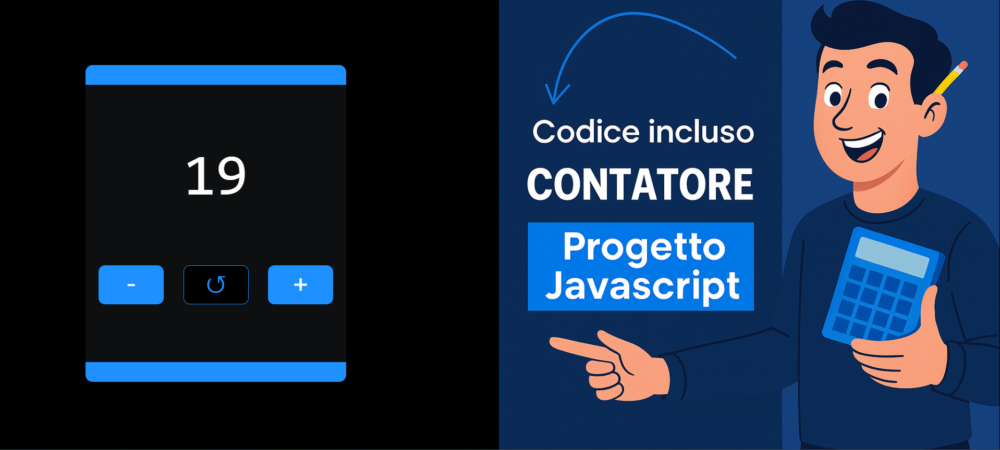

<!-- PROJECT SHIELDS -->

<!-- PROJECT LOGO -->
 

  

  <h3 align="center">JavaScript Counter</h3>

  

    Un counter interamente generato tramite JavaScript, senza HTML statico: elementi, stile e animazioni creati via DOM API.
     
    <a href="https://antoniods1.github.io/html-counter" target="_blank"><strong>Visita il sito»</strong></a>
      
    <a href="https://github.com/AntonioDS1/html-counter/issues">Segnala Bug</a>
    ·
    <a href="https://github.com/AntonioDS1/html-counter/issues">Richiedi Funzionalità</a>
  

---

## 📌 About the Project

Questo progetto mostra come costruire una mini-applicazione completamente tramite JavaScript, senza HTML precompilato.  
L’interfaccia e la logica vengono create dinamicamente:

✔️ Interfaccia generata al 100% via JavaScript  
✔️ Pulsanti `+`, `−` e `↺` con animazioni  
✔️ Conferma prima dei numeri negativi  
✔️ Layout responsive  
✔️ Immagine laterale “shower” cliccabile  
✔️ Meta-tag OG e Twitter integrati  
✔️ Nessuna libreria esterna

(<a href="#readme-top">back to top</a>)

---

## 🛠️ Built With

- HTML5  
- CSS3  
- JavaScript (DOM, Eventi, Stili dinamici)  
- GitHub Pages per il deploy  

(<a href="#readme-top">back to top</a>)

---

## 🚀 Getting Started

Per iniziare, clona il repository:

    git clone https://github.com/AntonioDS1/html-counter.git

Apri il file `index.html`.  
Non sono richieste dipendenze.

### Progetto Online
Il progetto è disponibile qui:  
👉 <a href="https://antoniods1.github.io/html-counter" target="_blank">https://antoniods1.github.io/html-counter</a>

(<a href="#readme-top">back to top</a>)

---

## 📬 Contact

**Antonio De Siena**  
GitHub: https://github.com/AntonioDS1  
Project Link: <a href="https://antoniods1.github.io/html-counter" target="_blank">https://antoniods1.github.io/html-counter</a>

(<a href="#readme-top">back to top</a>)

---
